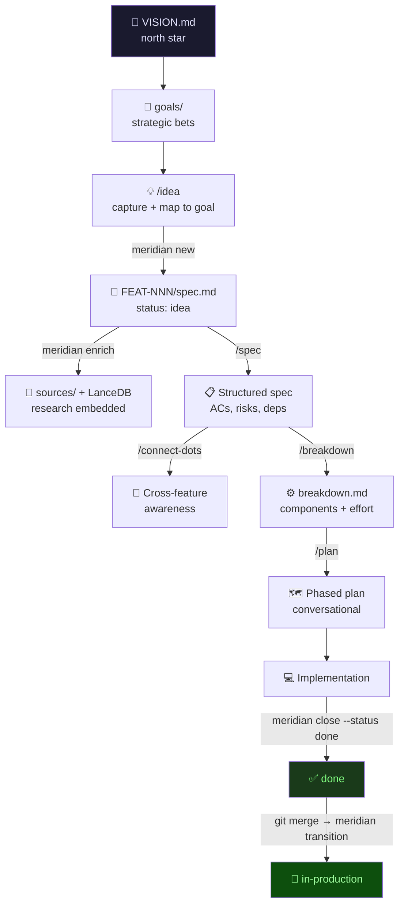
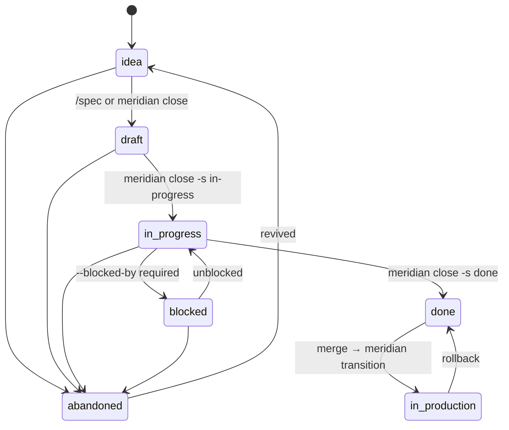
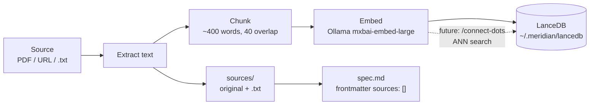

# Meridian

> Navigate your codebase with purpose.

AI-driven development workflow system. Manages the full lifecycle from idea to production: captures, enriches with research, elaborates specs, tracks progress, and keeps everything aligned to a strategic vision.

---

## Mental model

```
┌─────────────────────────────────────────────────────────────────────────┐
│                        M E R I D I A N                                  │
├──────────────────────────────────┬──────────────────────────────────────┤
│  HIERARCHY                       │  FEATURE LIFECYCLE                   │
│                                  │                                      │
│  specs/VISION.md  ← north star   │  idea ──► draft ──► in-progress      │
│    └── goals/     ← bets         │                         │    │       │
│         └── FEAT-NNN/            │                      blocked  done   │
│               spec.md            │                         │      │     │
│               breakdown.md       │                      abandoned  ★    │
│               sources/           │                             in-prod  │
│               summaries/         │                                      │
├──────────────────────────────────┼──────────────────────────────────────┤
│  CLI  (mechanical ops)           │  SLASH COMMANDS  (AI reasoning)      │
│                                  │                                      │
│  meridian new "idea"             │  /vision      read/update north star │
│  meridian enrich <f> <src>       │  /goal new    validated goal         │
│  meridian status                 │  /idea        capture → stub spec    │
│  meridian close <f> -s <s>       │  /spec        elaborate spec         │
│  meridian index                  │  /connect-dots  cross-feature map    │
│  meridian sync-jobs              │  /breakdown   technical decomp       │
│  meridian transition             │  /plan        phased impl plan       │
│                                  │  /roadmap     goals × features       │
│  RESEARCH PIPELINE               │  /challenge   stress-test idea       │
│  source → extract → chunk        │  /decision    write ADR              │
│        → embed (Ollama)          │                                      │
│        → LanceDB                 │  Rule: CLI owns ops.                 │
│        → sources/ + spec         │        Skills own reasoning.         │
└──────────────────────────────────┴──────────────────────────────────────┘
```

---

## Workflow



---

## Feature lifecycle



---

## CLI reference

| Command | What it does |
|---|---|
| `meridian new "idea text"` | Allocate FEAT-NNN, write stub spec, update REGISTRY |
| `meridian enrich feat-007 <src>` | Ingest PDF/URL → extract → embed → LanceDB |
| `meridian status` | Dashboard: all features × lifecycle × status |
| `meridian close feat-007 --status <s>` | Lifecycle transition with guard rails |
| `meridian index` | Rebuild REGISTRY.md + re-embed all sources |
| `meridian sync-jobs` | Auto-link Databricks jobs to specs |
| `meridian transition --from-merge <branch>` | Auto-advance to `in-production` on merge |

**Valid `--status` values:** `idea` `draft` `in-progress` `blocked` `done` `in-production` `abandoned`

---

## Slash commands reference

| Command | Reads | Writes |
|---|---|---|
| `/vision` | `VISION.md` | `VISION.md` |
| `/goal new` | `VISION.md`, `goals/` | `goals/goal-NN.md` |
| `/goal review` | `VISION.md`, `goals/`, all specs | — (report only) |
| `/idea <text>` | `VISION.md`, `goals/`, REGISTRY | runs `meridian new` |
| `/spec <feat-id>` | spec, goal, summaries | `spec.md` body + status→draft |
| `/connect-dots [feat-id]` | all specs | — (report only) |
| `/breakdown <feat-id>` | spec, goal, deps | `breakdown.md` + status→in-progress |
| `/plan <feat-id>` | spec, breakdown | — (conversational output) |
| `/roadmap` | VISION, goals, all specs | — (report only) |
| `/challenge <subject>` | VISION, goals, spec | — (7-point stress test) |
| `/decision <title>` | `decisions/` | `decisions/NNN-slug.md` |

---

## Research pipeline (`meridian enrich`)



---

## Stack

| Layer | Technology |
|---|---|
| Embeddings | Ollama `mxbai-embed-large` (local, 1024-dim) |
| Vector store | LanceDB at `~/.meridian/lancedb` (global, cross-branch) |
| Reranker | `BAAI/bge-reranker-v2-m3` *(planned)* |
| PDF extraction | pypdf |
| URL extraction | httpx + beautifulsoup4 |
| CLI framework | Typer + Rich |
| Spec format | Markdown + YAML frontmatter |

---

## Installation

```bash
# From repo root
pip install -e .

# Verify
meridian --help
```

**Ollama setup** (required for `enrich` and `index`):

```bash
ollama serve            # start the server
ollama pull mxbai-embed-large
```

---

## Configuration (`.meridian.toml`)

```toml
[meridian]
specs_path    = "specs"
lancedb_path  = "~/.meridian/lancedb"
ollama_model  = "mxbai-embed-large"
reranker_model = "BAAI/bge-reranker-v2-m3"

[databricks]
host      = "https://your-workspace.azuredatabricks.net"
token_env = "DATABRICKS_TOKEN"
```

---

## Typical session

```bash
# 1. Set your north star
/vision

# 2. Create a strategic goal
/goal new

# 3. Capture an idea
/idea "portfolio rebalancing engine with drift detection"

# 4. Add research
meridian enrich feat-001 ~/Downloads/rebalancing_paper.pdf
meridian enrich feat-001 https://example.com/drift-detection

# 5. Elaborate the spec (reads sources automatically)
/spec feat-001

# 6. Check cross-feature relationships
/connect-dots

# 7. Break it down technically
/breakdown feat-001

# 8. Plan implementation
/plan feat-001

# 9. Track progress
meridian status

# 10. Ship it
meridian close feat-001 --status done
# → after merge:
meridian transition --from-merge feat/feat-001-rebalancing
```
