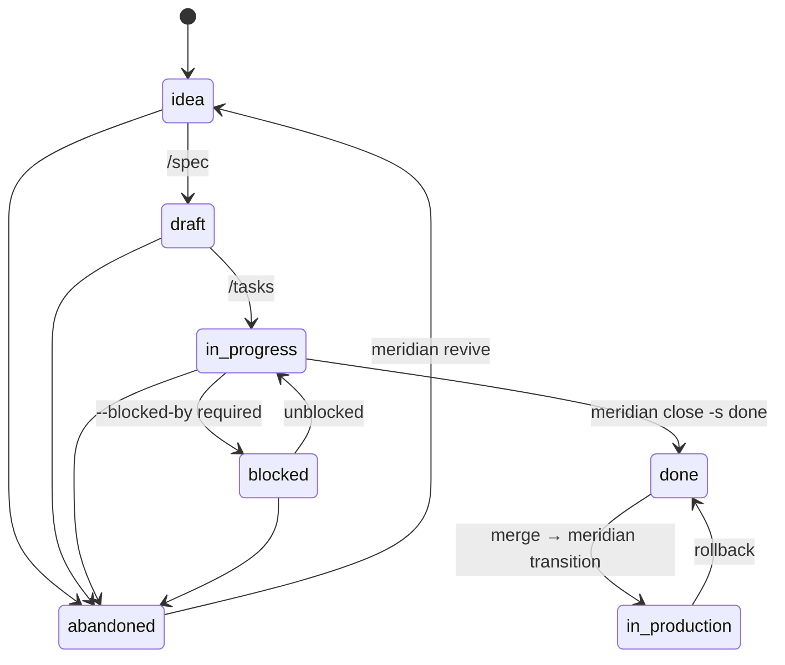

# Meridian

> Navigate your codebase with purpose.

AI-driven development workflow system. Manages the full lifecycle from idea to production — captures ideas, enriches with research, elaborates specs, plans work, tracks progress, and keeps everything aligned to a strategic vision.

Designed to be **installed into other projects**, not used standalone.

---

## Mental model

```
┌─────────────────────────────────────────────────────────────────────────┐
│                        M E R I D I A N                                  │
├──────────────────────────────────┬──────────────────────────────────────┤
│  HIERARCHY                       │  FEATURE LIFECYCLE                   │
│                                  │                                      │
│  specs/VISION.md  ← north star   │  idea ──► draft ──► in-progress      │
│    └── goals/     ← bets         │                         │    │       │
│         └── FEAT-NNN/            │                      blocked  done   │
│               spec.md            │                         │      │     │
│               breakdown.md       │                      abandoned  ★    │
│               sources/           │                             in-prod  │
│               summaries/         │                                      │
├──────────────────────────────────┼──────────────────────────────────────┤
│  CLI  (mechanical ops)           │  SLASH COMMANDS  (AI reasoning)      │
│                                  │                                      │
│  meridian init                   │  /vision      read/update north star │
│  meridian new "idea"             │  /goal new    validated goal         │
│  meridian enrich <f> <src>       │  /idea        capture → stub spec    │
│  meridian status                 │  /spec        elaborate spec         │
│  meridian close <f> -s <s>       │  /connect-dots  cross-feature map    │
│  meridian index                  │  /breakdown   technical decomp       │
│  meridian transition             │  /tasks       atomic task list       │
│  meridian guide                  │  /roadmap     goals × features       │
│                                  │                                      │
│  RESEARCH PIPELINE               │  Rule: CLI owns ops.                 │
│  source → extract → chunk        │        Skills own reasoning.         │
│        → embed (Ollama)          │                                      │
│        → LanceDB                 │                                      │
└──────────────────────────────────┴──────────────────────────────────────┘
```

---

## Installation

### 1. Install the package

```bash
# recommended — installs the CLI as a standalone tool
uv tool install git+https://github.com/Tomkess/meridian

# a specific release
uv tool install git+https://github.com/Tomkess/meridian@v0.2.0

# working on Meridian itself
uv tool install --editable .
```

> Meridian is installed from git, not PyPI. The name `meridian` on PyPI belongs to an
> unrelated project — `pip install meridian` gets you someone else's package.

### 2. Bootstrap your project

Run once in your project root:

```bash
meridian init
```

This creates:
- `.meridian.toml` — config file
- `specs/` — feature directory with `VISION.md`, `STEERING.md`, `CYCLES.md`, `SKILLS.md`, `REGISTRY.md`, `goals/`, `decisions/`
- `.claude/commands/meridian/` — 15 Claude Code skill files (namespaced as `/meridian:<name>`)

### 3. Set up Ollama (for research features)

Required only for `meridian enrich` and `meridian search`:

```bash
ollama serve
ollama pull mxbai-embed-large
```

`meridian enrich --vision` additionally needs a multimodal model pulled and named in
`.meridian.toml` as `ollama_vision_model`. It is a *fallback* describer for headless runs — when an
agent can see the screenshot, prefer `/meridian:enrich`, which writes a far more accurate reading
and needs no extra model:

```bash
ollama pull qwen2.5vl:7b        # then: ollama_vision_model = "qwen2.5vl:7b"
```

### 4. Check your setup

```bash
meridian guide
```

---

## Workflow


---

## Feature lifecycle



---

## CLI reference

| Command | What it does |
|---|---|
| `meridian init` | Bootstrap Meridian: .meridian.toml + specs/ + .claude/commands/meridian/ |
| `meridian status` | Dashboard: all features × lifecycle × task progress [N/M] |
| `meridian new "idea text"` | Allocate FEAT-NNN, write stub spec, update REGISTRY |
| `meridian new "idea" --goal goal-01 --appetite m` | Capture with goal link and appetite |
| `meridian close feat-007 --status <s>` | Lifecycle transition with guard rails |
| `meridian close feat-007 --status blocked --blocked-by <r>` | Block with explicit reason |
| `meridian close feat-007 --status abandoned --abandoned-reason <r>` | Abandon with reason (persists through revive) |
| `meridian close feat-007 --confidence high` | Update problem confidence: low \| medium \| high |
| `meridian cycle feat-007 --set 2026-Q2` | Assign to planning cycle |
| `meridian cycle feat-007 --clear` | Remove from cycle |
| `meridian revive feat-007` | Revive abandoned feature → idea (preserves reason) |
| `meridian enrich feat-007 report.pdf` | Ingest PDF / URL / file → LanceDB |
| `meridian enrich feat-007 shot.png --note "what is wrong"` | Ingest a screenshot: image copied verbatim, notes embedded |
| `meridian enrich feat-007 --latest-screenshot --note "…"` | Same, using the newest image in the OS screenshot dir |
| `meridian enrich feat-007 --from-clipboard --note "…"` | Same, using the clipboard image (macOS) |
| `meridian enrich feat-007 shot.png --note-file notes.md` | Take notes (and any agent visual reading) from a sidecar |
| `meridian enrich feat-007 shot.png --note "…" --vision` | Fallback: add a local Ollama vision caption |
| `meridian search "query"` | Semantic search across all enriched research |
| `meridian index` | Rebuild REGISTRY.md + full vector index |
| `meridian link-job feat-007 <job>` | Link a Databricks job to a feature |
| `meridian unlink-job feat-007` | Remove Databricks job link |
| `meridian transition --from-merge feat-007/slug` | Auto-transition to in-production after merge |
| `meridian guide` | 8-step project advisor |
| `meridian help` | Full manual |

**Valid `--status` values:** `idea` `draft` `in-progress` `blocked` `done` `in-production` `abandoned`

---

## Slash commands reference

| Command | Reads | Writes |
|---|---|---|
| `/vision` | `VISION.md` | `VISION.md` |
| `/goal new` | `VISION.md`, `goals/` | `goals/goal-NN.md` |
| `/idea <text>` | `VISION.md`, `goals/`, REGISTRY | runs `meridian new` |
| `/spec <feat-id>` | spec, goal, sources, STEERING.md | `spec.md` body; status→draft |
| `/breakdown <feat-id>` | spec, goal, deps, STEERING.md | `breakdown.md` |
| `/tasks <feat-id>` | spec, breakdown, STEERING.md | `tasks.md`; status→in-progress |
| `/plan <feat-id>` | spec, breakdown | `plan.md` (optional, for `l` appetite) |
| `/connect-dots [feat-id]` | all specs | — (report only) |
| `/roadmap` | VISION, goals, all specs | — (report only) |
| `/challenge <subject>` | VISION, goals, spec | — (stress-test report) |
| `/decision <title>` | `decisions/` | `decisions/NNN-slug.md` |
| `/enrich <feat> "<note>"` | attached screenshot | `sources/<slug>.png` + `.notes.md` |
| `/ask [question]` | enriched research chunks | — (RAG answer) |
| `/research <feat>` | all sources, search index | — (synthesis report) |
| `/brief <feat> [source]` | source file | `summaries/*-brief.md` |

---

## Configuration (`.meridian.toml`)

```toml
[meridian]
specs_path     = "specs"
lancedb_path   = "~/.meridian/lancedb"   # global by default — shared across branches
ollama_model   = "mxbai-embed-large"
reranker_model = "BAAI/bge-reranker-v2-m3"

[databricks]
host      = "https://your-workspace.azuredatabricks.net"
token_env = "DATABRICKS_TOKEN"            # env var holding the PAT

# Optional: override Databricks status fetch timeout (default 8s)
# status_timeout = 8
```

---

## Typical session

```bash
# 1. Set your north star
/vision

# 2. Fill in AI context for this codebase
# Edit specs/STEERING.md with architecture rules, naming conventions, glossary

# 3. Create a strategic goal
/goal new

# 4. Capture an idea
/idea "portfolio rebalancing engine with drift detection"

# 5. Add research
meridian enrich feat-001 ~/Downloads/rebalancing_paper.pdf
meridian enrich feat-001 https://example.com/drift-detection

# 6. Elaborate the spec
/spec feat-001

# 7. Check cross-feature relationships
/connect-dots

# 8. Break it down technically
/breakdown feat-001

# 9. Generate atomic tasks
/tasks feat-001

# 10. Track progress
meridian status

# 11. Ship it
meridian close feat-001 --status done
# → after merge:
meridian transition --from-merge feat-001/rebalancing-engine
```

---

## Stack

| Layer | Technology |
|---|---|
| Embeddings | Ollama `mxbai-embed-large` (local, 1024-dim) |
| Vector store | LanceDB at `~/.meridian/lancedb` (global, cross-branch) |
| Reranker | `BAAI/bge-reranker-v2-m3` (optional; install `meridian[rerank]`) |
| PDF extraction | pypdf |
| URL extraction | httpx + beautifulsoup4 |
| CLI framework | Typer + Rich |
| Spec format | Markdown + YAML frontmatter |

---

## Development

```bash
git clone https://github.com/your-org/meridian
cd meridian
uv pip install -e ".[dev]"

# Run tests
pytest tests/

# Static analysis
ruff check .
mypy meridian/
```
